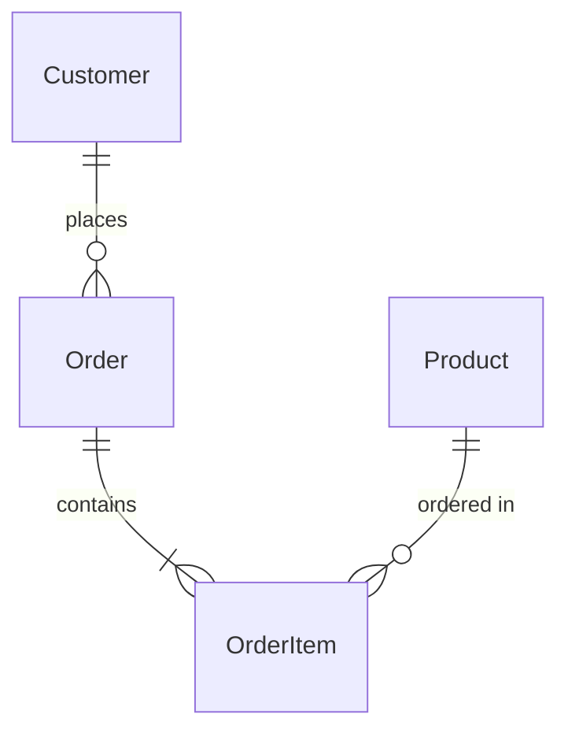

# Technical Design

Generate a **technical design document** for feature **$1**.

## Task: Create Technical Design Document

### 1. Prerequisites & File Handling
- **Requirements Approval Check**: 
  - If invoked with `-y` ($2 == "-y"), set `requirements.approved=true` in `spec.json`
  - Otherwise, **stop** with an actionable message if requirements are missing or unapproved
- **Design File Handling**:
  - If design.md does not exist: Create new design.md file
  - If design.md exists: Interactive prompt with options:
    - **[o] Overwrite**: Generate completely new design document
    - **[m] Merge**: Generate new design document using existing content as reference context  
    - **[c] Cancel**: Stop execution for manual review
- **Context Loading**: Read `.kiro/specs/$1/requirements.md`, core steering documents, and existing design.md (if merge mode)

### 2. Discovery & Analysis Phase

**CRITICAL**: Before generating the design, conduct thorough research and analysis:

#### Feature Classification & Process Adaptation
**Classify feature type to adapt process scope**:
- **New Feature** (greenfield): Full process including technology selection and architecture decisions
- **Extension** (existing system): Focus on integration analysis, minimal architectural changes
- **Simple Addition** (CRUD, UI): Streamlined process, follow established patterns
- **Complex Integration** (external systems, new domains): Comprehensive analysis and risk assessment

**Process Adaptation**: Skip or streamline analysis steps based on classification above

#### A. Requirements to Technical Components Mapping
- Map requirements (EARS format) to technical components
- Extract non-functional requirements (performance, security, scalability)
- Identify core technical challenges and constraints

#### B. Existing Implementation Analysis 
**MANDATORY when modifying or extending existing features**:
- Analyze codebase structure, dependencies, patterns
- Map reusable modules, services, utilities
- Understand domain boundaries, layers, data flow
- Determine extension vs. refactor vs. wrap approach
- Prioritize minimal changes and file reuse

**Optional for completely new features**: Review existing patterns for consistency and reuse opportunities

#### C. Steering Alignment Check
- Verify alignment with core steering documents (`structure.md`, `tech.md`, `product.md`) and any custom steering files
  - **Core steering**: @.kiro/steering/structure.md, @.kiro/steering/tech.md, @.kiro/steering/product.md
  - **Custom steering**: All additional `.md` files in `.kiro/steering/` directory (e.g., `api.md`, `testing.md`, `security.md`)
- Document deviations with rationale for steering updates

#### D. Technology & Alternative Analysis
**For New Features or Unknown Technology Areas**:
- Research latest best practices using WebSearch/WebFetch when needed in parallel
- Compare relevant architecture patterns (MVC, Clean, Hexagonal) if pattern selection is required
- Assess technology stack alternatives only when technology choices are being made
- Document key findings that impact design decisions

**Skip this step if**: Using established team technology stack and patterns for straightforward feature additions

#### E. Implementation-Specific Investigation
**When new technology or complex integration is involved**:
- Verify specific API capabilities needed for requirements
- Check version compatibility with existing dependencies
- Identify configuration and setup requirements
- Document any migration or integration challenges

**Skip if**: Using familiar technology stack in standard patterns

#### F. Technical Risk Assessment
- Performance/scalability risks: bottlenecks, capacity, growth
- Security vulnerabilities: attack vectors, compliance gaps
- Maintainability risks: complexity, knowledge, support
- Integration complexity: dependencies, coupling, API changes
- Technical debt: new creation vs. existing resolution

## Design Document Structure & Guidelines

### Core Principles
- **Review-optimized structure**: Critical technical decisions prominently placed to prevent oversight
- **Contextual relevance**: Include sections only when applicable to project type and scope
- **Visual-first design**: Essential Mermaid diagrams for architecture and data flow
- **Design focus only**: Architecture and interfaces, NO implementation code
- **Type safety**: Never use `any` type - define explicit types and interfaces
- **Formal tone**: Use definitive, declarative statements without hedging language
- **Language**: Use language from `spec.json.language` field, default to English

### Document Sections

**CORE SECTIONS** (Include when relevant):
- Overview, Architecture, Components and Interfaces (always)
- Data Models, Error Handling, Testing Strategy (when applicable)
- Security Considerations (when security implications exist)

**CONDITIONAL SECTIONS** (Include only when specifically relevant):
- Performance & Scalability (for performance-critical features)
- Migration Strategy (for existing system modifications)

<structured-document>
## Overview (2-3 paragraphs max)

**Purpose**: This feature delivers [specific value] to [target users].
**Users**: [Target user groups] will utilize this for [specific workflows].
**Impact** (if applicable): Changes the current [system state] by [specific modifications].


### Goals
- Primary objective 1
- Primary objective 2  
- Success criteria

### Non-Goals
- Explicitly excluded functionality
- Future considerations outside current scope
- Integration points deferred

## Architecture

### Existing Architecture Analysis (if applicable)
When modifying existing systems:
- Current architecture patterns and constraints
- Existing domain boundaries to be respected
- Integration points that must be maintained
- Technical debt addressed or worked around

### High-Level Architecture
**RECOMMENDED**: Include Mermaid diagram showing system architecture (required for complex features, optional for simple additions)

**Architecture Integration**:
- Existing patterns preserved: [list key patterns]
- New components rationale: [why each is needed]
- Technology alignment: [how it fits current stack]
- Steering compliance: [principles maintained]

### Data Flow
**RECOMMENDED**: Include sequence diagram or flowchart showing data flow when data interactions are complex or span multiple systems

### Technology Stack and Design Decisions

**Technology Stack**:
- **Frontend**: [Framework/Library] - rationale, alternatives considered
- **Backend**: [Framework/Runtime] - rationale, alternatives considered
- **Database**: [Type/Technology] - rationale, alternatives considered
- **Infrastructure**: [Deployment/Hosting] - rationale, alternatives considered

**Architecture Pattern Selection**:
- **Chosen Pattern**: [e.g., Clean Architecture, Hexagonal, MVC]
- **Rationale**: Why this pattern fits requirements and constraints
- **Alternatives Considered**: Other patterns evaluated and rejection reasons
- **Integration Approach**: How pattern integrates with existing systems

**Key Design Decisions**:

**Decision**: Brief decision description
- **Context**: Problem that needed solving  
- **Alternatives**: Other approaches considered
- **Selected Approach**: Chosen solution
- **Rationale**: Why optimal based on trade-off analysis
- **Trade-offs**: Benefits gained vs. costs incurred

## Components and Interfaces

**Implementation Strategy** (when existing code exists):
- Existing components to modify vs. create new
- Integration with existing architecture
- File mapping for updates
- Dependency impact assessment

### Component Name

**Implementation Approach**: 
- If modifying: file path and changes description
- If new: justification for not extending existing
- DDD compliance: aggregate boundaries, domain services

**Function**: Component's core responsibility.

**Key Features**:
- Core capability 1 - brief description
- Core capability 2 - brief description  
- Unique differentiator - what makes it special

**API Endpoints** (if applicable):

| Method | Route | Purpose | Auth | Status Codes |
|--------|-------|---------|------|--------------|
| GET | /api/users | Retrieve user list | Required | 200, 401, 403 |
| POST | /api/users | Create new user | Required | 201, 400, 401 |

**API Specification Details**:

**GET /api/users**
- **Query Parameters**: `limit` (number, max 100), `offset` (number), `filter` (string)
- **Response Headers**: `X-Total-Count`, `Content-Type: application/json`
- **Success Response** (200):
```json
{
  "users": [{ "id": "uuid", "email": "string", "name": "string", "role": "enum" }],
  "pagination": { "total": "number", "limit": "number", "offset": "number" }
}
```

**POST /api/users**
- **Request Headers**: `Content-Type: application/json`, `Authorization: Bearer {token}`
- **Request Body**:
```json
{ "email": "string (required)", "name": "string (required)", "role": "admin|user|guest" }
```
- **Success Response** (201):
```json
{ "id": "uuid", "email": "string", "name": "string", "role": "enum", "createdAt": "ISO8601" }
```

**Interface Design** (core methods only, use technology stack language):
```typescript
// Core methods only - NO implementation details
// NEVER use 'any' type - define specific types instead
interface UserService {
  findAll(): Promise<User[]>;
  create(userData: CreateUserRequest): Promise<User>;
}
```

**Integration Points**: Interaction with existing modules, dependencies, interface changes

**Rationale**: Design choices and trade-offs

## Data Models

**IMPORTANT**: Only include sections relevant to the project. Skip Database Schema for API-only or frontend-only features.

### Domain Model
Core entities and their relationships.

**RECOMMENDED**: Include ER diagram for complex relationships:


### User
**Function**: User data storage and validation
**Constraints**: Email uniqueness, role enumeration

```typescript
// Use technology stack language
interface User {
  id: string;
  email: string;
  role: 'admin' | 'user' | 'guest';
}
```

### Database Schema
**Only include when database implementation is required.**

#### Users Table
```sql
CREATE TABLE users (
  id UUID PRIMARY KEY,
  email VARCHAR UNIQUE NOT NULL,
  role VARCHAR CHECK (role IN ('admin', 'user', 'guest'))
);
```

## Error Handling

### Error Strategy
Concrete error handling patterns and recovery mechanisms for each error type.

### Error Categories and Responses
**User Errors** (4xx): Invalid input → field-level validation; Unauthorized → auth guidance; Not found → navigation help
**System Errors** (5xx): Infrastructure failures → graceful degradation; Timeouts → circuit breakers; Exhaustion → rate limiting  
**Business Logic Errors** (422): Rule violations → condition explanations; State conflicts → transition guidance

**Process Flow Visualization** (when complex business logic exists):
Include Mermaid flowchart only for complex error scenarios with business workflows.

### Monitoring
Error tracking, logging, and health monitoring implementation.

## Testing Strategy

### Default sections (adapt names/sections to fit the domain)
- Unit Tests: 3–5 items from core functions/modules (e.g., auth methods, subscription logic)
- Integration Tests: 3–5 cross-component flows (e.g., webhook handling, notifications)
- E2E/UI Tests (if applicable): 3–5 critical user paths (e.g., forms, dashboards)
- Performance/Load (if applicable): 3–4 items (e.g., concurrency, high-volume ops)

## Optional Sections (include when relevant)

### Security Considerations
**Include when**: Features handle authentication, sensitive data, external integrations, or user permissions
- Threat modeling, security controls, compliance requirements
- Authentication and authorization patterns
- Data protection and privacy considerations

### Performance & Scalability
**Include when**: Features have specific performance requirements, high load expectations, or scaling concerns
- Target metrics and measurement strategies
- Scaling approaches (horizontal/vertical)
- Caching strategies and optimization techniques

### Migration Strategy
**REQUIRED**: Include Mermaid flowchart showing migration phases

**Process**: Phase breakdown, rollback triggers, validation checkpoints
</structured-document>

---

## Process Instructions (NOT included in design.md)

### Visual Design Guidelines
**Include based on complexity**: 
- **Simple features**: Basic component diagram or none if trivial
- **Complex features**: Architecture diagram, data flow diagram, ER diagram (if complex)
- **When helpful**: State machines, component interactions, decision trees, process flows, auth flows, approval workflows, data pipelines

**Mermaid Diagram Rules**:
- Use only basic graph syntax with nodes and relationships
- Exclude all styling elements (no style definitions, classDef, fill colors)
- Avoid visual customization (backgrounds, custom CSS)
- Example: `graph TB` → `A[Login] --> B[Dashboard]` → `B --> C[Settings]`

### Quality Checklist
- [ ] Requirements covered with traceability
- [ ] Existing implementation respected
- [ ] Steering compliant, deviations documented
- [ ] Architecture visualized with clear diagrams
- [ ] Components have Purpose, Key Features, Interface Design
- [ ] Data models individually documented
- [ ] Integration with existing system explained

### 3. Design Document Generation & Metadata Update
- Generate complete design document following structure guidelines
- Update `.kiro/specs/$1/spec.json`:
```json
{
  "phase": "design-generated", 
  "approvals": {
    "requirements": { "generated": true, "approved": true },
    "design": { "generated": true, "approved": false }
  },
  "updated_at": "current_timestamp"
}
```

### Actionable Messages
If requirements are not approved and no `-y` flag ($2 != "-y"):
- **Error Message**: "Requirements must be approved before generating design. Run `/kiro:spec-requirements $1` to review requirements, then run `/kiro:spec-design $1 -y` to proceed."
- **Alternative**: "Or run `/kiro:spec-design $1 -y` to auto-approve requirements and generate design."

### Conversation Guidance
After generation:
- Guide user to review design narrative and visualizations
- Suggest specific diagram additions if needed
- Direct to run `/kiro:spec-tasks $1 -y` when approved

Create design document that tells complete story through clear narrative, structured components, and effective visualizations. think deeply