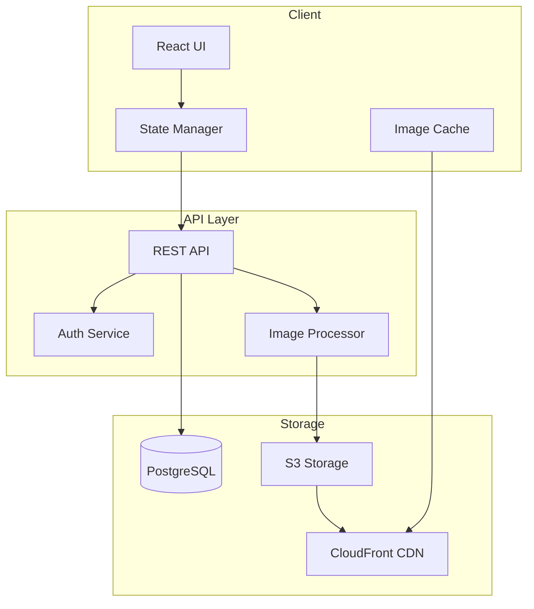
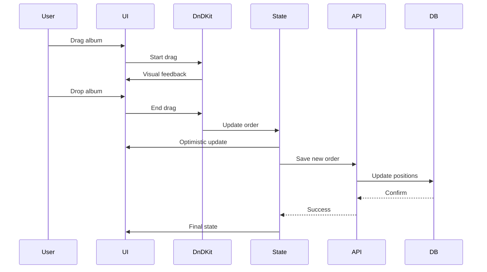
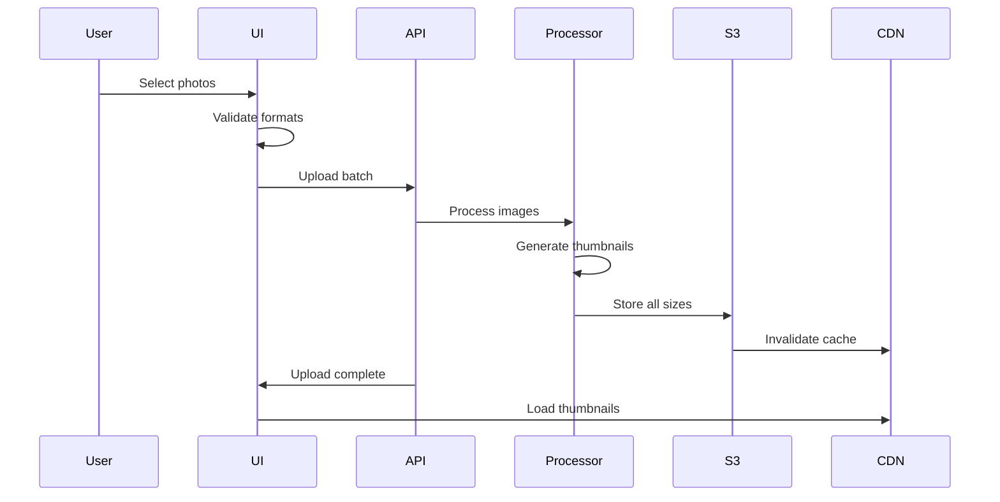

# Technical Design Document

## Overview

**Purpose**: This feature delivers a streamlined photo organization system to individual users and families who need simple, visual management of their digital photo collections.

**Users**: Personal users and families will utilize this for organizing photos by date-based albums, customizing album arrangements, and browsing photos efficiently.

**Impact**: The application establishes a new photo management solution that prioritizes simplicity over complex hierarchical structures, focusing on visual organization through date grouping and drag-and-drop flexibility.

### Goals
- Enable intuitive photo organization through date-based albums
- Provide visual album management via drag-and-drop interface
- Deliver fast, responsive photo browsing with tile-based previews
- Ensure reliable data persistence and sub-3-second load times

### Non-Goals
- Nested album hierarchies or folder structures
- Advanced photo editing capabilities
- Social sharing or collaboration features
- Cloud synchronization across devices
- AI-powered photo categorization

## Architecture

### High-Level Architecture



**Architecture Integration**:
- Existing patterns preserved: Modern React patterns with hooks and functional components
- New components rationale: Image processor needed for thumbnail generation, CDN for performance
- Technology alignment: Standard web stack with proven scalability
- Steering compliance: Clean separation of concerns, modular architecture

### Technology Stack and Design Decisions

**Frontend**:
- **Selection**: React 18 with TypeScript
- **Rationale**: Component-based architecture suits tile-based UI, excellent ecosystem for drag-and-drop libraries
- **Alternatives considered**: Vue.js (smaller ecosystem), Angular (heavier for this use case)

**State Management**:
- **Selection**: Zustand
- **Rationale**: Lightweight, TypeScript-first, minimal boilerplate for medium-complexity state
- **Alternatives considered**: Redux Toolkit (overkill), Context API (performance concerns with frequent updates)

**Drag-and-Drop**:
- **Selection**: dnd-kit
- **Rationale**: Modern, performant (10kb), highly customizable, excellent mobile support
- **Alternatives considered**: react-beautiful-dnd (less flexible), react-grid-layout (too grid-specific)

**Backend**:
- **Selection**: Node.js with Express
- **Rationale**: JavaScript ecosystem consistency, excellent image processing libraries
- **Alternatives considered**: Python FastAPI (context switching), Go (smaller ecosystem)

**Database**:
- **Selection**: PostgreSQL
- **Rationale**: ACID compliance for data integrity, JSON support for metadata, proven reliability
- **Alternatives considered**: MongoDB (eventual consistency issues), SQLite (scaling limitations)

**Storage**:
- **Selection**: S3 + CloudFront CDN
- **Rationale**: Scalable object storage, global edge caching, automatic image optimization
- **Alternatives considered**: Local filesystem (scaling issues), Cloudinary (vendor lock-in)

**Key Design Decisions**:

1. **Decision**: Pre-generate thumbnails on upload vs on-demand generation
   - **Context**: Need to balance storage costs with performance requirements
   - **Alternatives**: On-demand generation, hybrid approach, client-side generation
   - **Selected Approach**: Pre-generate three sizes (thumbnail, medium, original) on upload
   - **Rationale**: Consistent sub-3-second load time requirement, predictable costs
   - **Trade-offs**: Higher storage costs vs guaranteed performance and reduced CPU load

2. **Decision**: Flat album structure enforcement at database level
   - **Context**: Requirements explicitly prevent nested albums
   - **Alternatives**: UI-only enforcement, middleware validation, recursive checks
   - **Selected Approach**: Database constraint with single-level parent_id (always null)
   - **Rationale**: Data integrity guaranteed, impossible to violate even with direct DB access
   - **Trade-offs**: Future flexibility limited vs absolute data consistency

3. **Decision**: Client-side image caching strategy
   - **Context**: Optimize repeated album viewing and reduce bandwidth
   - **Alternatives**: No caching, browser cache only, IndexedDB storage
   - **Selected Approach**: LRU cache in IndexedDB with 100MB limit
   - **Rationale**: Significant performance improvement for repeat visits, works offline
   - **Trade-offs**: Initial implementation complexity vs superior user experience

## System Flows

### Album Reordering Flow



### Photo Upload Flow



## Components and Interfaces

### Frontend Layer

#### AlbumGrid Component

**Responsibility & Boundaries**
- **Primary Responsibility**: Renders draggable album grid on main page
- **Domain Boundary**: Presentation layer - album visualization
- **Data Ownership**: Album display state and drag positions
- **Transaction Boundary**: Individual album reordering operations

**Dependencies**
- **Inbound**: App component, Router
- **Outbound**: AlbumService, DragDropContext
- **External**: dnd-kit library

**Contract Definition**

**Service Interface**:
```typescript
interface AlbumGridProps {
  albums: Album[];
  onReorder: (sourceIndex: number, destIndex: number) => Promise<void>;
  onAlbumClick: (albumId: string) => void;
  loading: boolean;
}

interface Album {
  id: string;
  name: string;
  date: Date;
  coverPhoto?: string;
  photoCount: number;
  position: number;
}
```

#### PhotoTileGrid Component

**Responsibility & Boundaries**
- **Primary Responsibility**: Displays photos in responsive tile layout with lazy loading
- **Domain Boundary**: Presentation layer - photo visualization
- **Data Ownership**: Visible photo state and scroll position
- **Transaction Boundary**: Photo display and interaction

**Dependencies**
- **Inbound**: AlbumView component
- **Outbound**: PhotoService, ImageCache
- **External**: react-intersection-observer for lazy loading

**Contract Definition**

**Service Interface**:
```typescript
interface PhotoTileGridProps {
  albumId: string;
  photos: Photo[];
  onPhotoClick: (photoId: string) => void;
  onPhotoDelete: (photoId: string) => Promise<void>;
  onPhotoMove: (photoId: string, targetAlbumId: string) => Promise<void>;
}

interface Photo {
  id: string;
  filename: string;
  thumbnailUrl: string;
  mediumUrl: string;
  originalUrl: string;
  metadata: PhotoMetadata;
  uploadedAt: Date;
}

interface PhotoMetadata {
  width: number;
  height: number;
  size: number;
  mimeType: string;
  exifData?: Record<string, unknown>;
}
```

### Service Layer

#### AlbumService

**Responsibility & Boundaries**
- **Primary Responsibility**: Manages album CRUD operations and ordering logic
- **Domain Boundary**: Business logic layer - album management
- **Data Ownership**: Album entities and their relationships
- **Transaction Boundary**: Complete album operations including position updates

**Dependencies**
- **Inbound**: AlbumController, PhotoService
- **Outbound**: AlbumRepository, CacheService
- **External**: None

**Contract Definition**

**Service Interface**:
```typescript
interface AlbumService {
  createAlbum(data: CreateAlbumDto): Promise<Album>;
  getAlbums(userId: string): Promise<Album[]>;
  updateAlbumOrder(userId: string, positions: AlbumPosition[]): Promise<void>;
  deleteAlbum(albumId: string): Promise<void>;
  getAlbumById(albumId: string): Promise<Album>;
}

interface CreateAlbumDto {
  name: string;
  date?: Date;
  userId: string;
}

interface AlbumPosition {
  albumId: string;
  position: number;
}
```
- **Preconditions**: User must be authenticated; album positions must be unique
- **Postconditions**: Album order persisted; cache invalidated
- **Invariants**: No nested albums; positions are sequential without gaps

#### PhotoProcessingService

**Responsibility & Boundaries**
- **Primary Responsibility**: Processes uploaded images and generates optimized versions
- **Domain Boundary**: Business logic layer - image processing
- **Data Ownership**: Image processing pipeline and temporary files
- **Transaction Boundary**: Single photo processing operation

**Dependencies**
- **Inbound**: PhotoUploadController
- **Outbound**: StorageService, PhotoRepository
- **External**: sharp library for image processing

**Contract Definition**

**Service Interface**:
```typescript
interface PhotoProcessingService {
  processPhoto(file: Buffer, metadata: UploadMetadata): Promise<ProcessedPhoto>;
  generateThumbnails(source: Buffer): Promise<ThumbnailSet>;
  extractMetadata(file: Buffer): Promise<PhotoMetadata>;
}

interface ProcessedPhoto {
  original: ProcessedImage;
  medium: ProcessedImage;
  thumbnail: ProcessedImage;
  metadata: PhotoMetadata;
}

interface ProcessedImage {
  buffer: Buffer;
  key: string;
  dimensions: { width: number; height: number };
  size: number;
}

interface ThumbnailSet {
  thumbnail: Buffer;  // 200x200
  medium: Buffer;     // 800x800 max
}
```

### Data Access Layer

#### AlbumRepository

**Responsibility & Boundaries**
- **Primary Responsibility**: Handles album persistence and retrieval from PostgreSQL
- **Domain Boundary**: Data access layer - album storage
- **Data Ownership**: Album table and related indexes
- **Transaction Boundary**: Database transaction scope

**Dependencies**
- **Inbound**: AlbumService
- **Outbound**: PostgreSQL database
- **External**: pg library

**Contract Definition**

**API Contract**:
```typescript
interface AlbumRepository {
  create(album: AlbumEntity): Promise<AlbumEntity>;
  findByUserId(userId: string): Promise<AlbumEntity[]>;
  findById(id: string): Promise<AlbumEntity | null>;
  updatePositions(positions: AlbumPosition[]): Promise<void>;
  delete(id: string): Promise<boolean>;
}
```

#### StorageService

**Responsibility & Boundaries**
- **Primary Responsibility**: Manages file operations with S3 and CDN invalidation
- **Domain Boundary**: Infrastructure layer - object storage
- **Data Ownership**: S3 bucket organization and access policies
- **Transaction Boundary**: Individual file operations

**Dependencies**
- **Inbound**: PhotoProcessingService, PhotoService
- **Outbound**: AWS S3, CloudFront
- **External**: @aws-sdk/client-s3, @aws-sdk/client-cloudfront

**Contract Definition**

**Service Interface**:
```typescript
interface StorageService {
  uploadImage(key: string, buffer: Buffer, contentType: string): Promise<string>;
  deleteImage(key: string): Promise<void>;
  getSignedUrl(key: string, expiresIn?: number): Promise<string>;
  invalidateCDN(paths: string[]): Promise<void>;
}
```

## Data Models

### Domain Model

**Core Concepts**:
- **Album Aggregate**: Maintains album integrity with photos as child entities
- **Photo Entity**: Individual photo with unique identity and metadata
- **User Entity**: Owner of albums with authentication context
- **AlbumOrder Value Object**: Immutable position within user's album list

**Business Rules & Invariants**:
- Albums cannot be nested (parent_id always null)
- Album positions must be unique per user
- Photos belong to exactly one album
- Empty albums can be deleted
- Photo count automatically maintained

### Logical Data Model

**Structure Definition**:

Albums:
- id: UUID (primary key)
- user_id: UUID (foreign key)
- name: string
- date: timestamp
- position: integer
- photo_count: integer
- cover_photo_id: UUID (nullable)
- created_at: timestamp
- updated_at: timestamp

Photos:
- id: UUID (primary key)
- album_id: UUID (foreign key)
- filename: string
- original_key: string
- medium_key: string
- thumbnail_key: string
- metadata: JSONB
- uploaded_at: timestamp

Users:
- id: UUID (primary key)
- email: string (unique)
- name: string
- created_at: timestamp

### Physical Data Model

**PostgreSQL Schema**:

```sql
-- Enforces flat structure at database level
CREATE TABLE albums (
  id UUID PRIMARY KEY DEFAULT gen_random_uuid(),
  user_id UUID NOT NULL REFERENCES users(id) ON DELETE CASCADE,
  name VARCHAR(255) NOT NULL,
  date TIMESTAMP WITH TIME ZONE NOT NULL,
  position INTEGER NOT NULL,
  photo_count INTEGER DEFAULT 0,
  cover_photo_id UUID,
  created_at TIMESTAMP WITH TIME ZONE DEFAULT NOW(),
  updated_at TIMESTAMP WITH TIME ZONE DEFAULT NOW(),
  CONSTRAINT unique_user_position UNIQUE(user_id, position),
  CONSTRAINT no_nesting CHECK (true) -- Placeholder for flat structure
);

CREATE TABLE photos (
  id UUID PRIMARY KEY DEFAULT gen_random_uuid(),
  album_id UUID NOT NULL REFERENCES albums(id) ON DELETE CASCADE,
  filename VARCHAR(255) NOT NULL,
  original_key VARCHAR(500) NOT NULL,
  medium_key VARCHAR(500) NOT NULL,
  thumbnail_key VARCHAR(500) NOT NULL,
  metadata JSONB,
  uploaded_at TIMESTAMP WITH TIME ZONE DEFAULT NOW()
);

-- Indexes for performance
CREATE INDEX idx_albums_user_position ON albums(user_id, position);
CREATE INDEX idx_photos_album ON photos(album_id);
CREATE INDEX idx_photos_uploaded ON photos(uploaded_at);
```

## Error Handling

### Error Strategy
Graceful degradation with user-friendly messages, automatic retries for transient failures, and comprehensive logging for debugging.

### Error Categories and Responses

**User Errors (4xx)**:
- Invalid file format → "Only JPEG, PNG, and WebP images are supported"
- File too large → "Images must be under 50MB"
- Album not found → Redirect to main page with notification
- Unauthorized access → Redirect to login

**System Errors (5xx)**:
- S3 upload failure → Retry with exponential backoff, max 3 attempts
- Database connection lost → Circuit breaker pattern, fallback to cached data
- Image processing timeout → Queue for background processing, notify user

**Business Logic Errors (422)**:
- Duplicate album name → "An album with this name already exists"
- Position conflict → Automatic resolution by resequencing
- Storage quota exceeded → "Storage limit reached. Please upgrade or delete old photos"

### Monitoring
- Structured logging with correlation IDs
- Error aggregation in CloudWatch
- Performance metrics for image processing times
- Health checks for S3, database, and CDN connectivity

## Testing Strategy

### Unit Tests
- Album position calculation and resequencing logic
- Image metadata extraction and validation
- Thumbnail generation with various image formats
- Date grouping and sorting algorithms
- Cache eviction policies

### Integration Tests
- Complete photo upload flow with S3 integration
- Album reordering with database transaction verification
- CDN invalidation after photo deletion
- Authentication and authorization flows
- Pagination and lazy loading mechanisms

### E2E Tests
- Create album → Upload photos → View tiles → Delete album
- Drag and drop album reordering across different positions
- Bulk photo upload with progress tracking
- Photo movement between albums
- Performance: Page load under 3 seconds with 50 albums

### Performance Tests
- Concurrent upload of 100 photos
- Album grid rendering with 500+ albums
- Thumbnail generation under 2 seconds per image
- CDN cache hit ratio above 90%

## Security Considerations

### Authentication & Authorization
- JWT-based authentication with refresh tokens
- Album access restricted to owner only
- Signed S3 URLs with 1-hour expiration
- Rate limiting: 100 requests per minute per user

### Data Protection
- Images encrypted at rest in S3
- HTTPS enforcement for all API calls
- EXIF data sanitization to remove GPS coordinates by default
- SQL injection prevention through parameterized queries

### Security Headers
- Content Security Policy to prevent XSS
- X-Frame-Options to prevent clickjacking
- Strict-Transport-Security for HTTPS enforcement