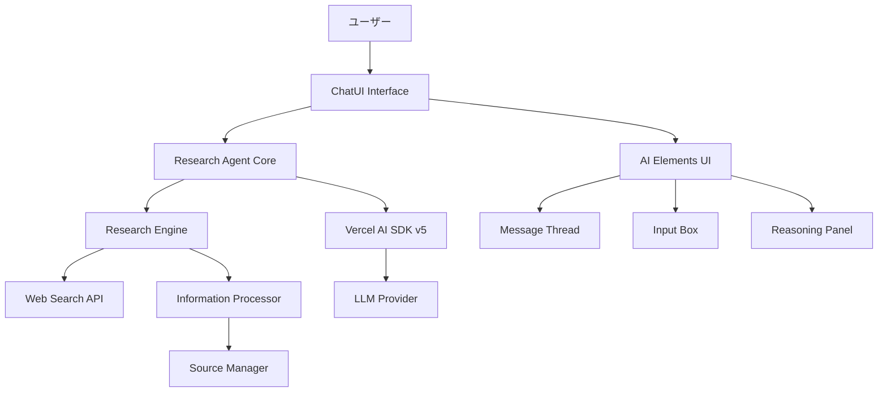
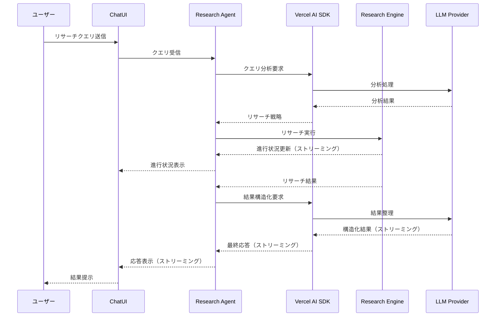
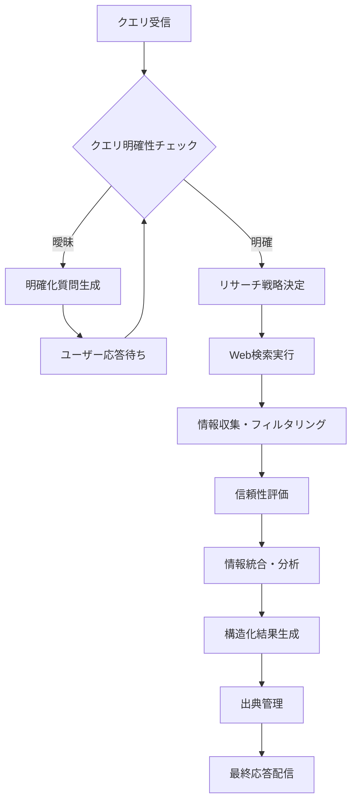
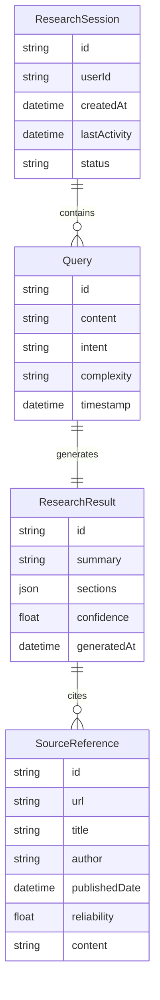
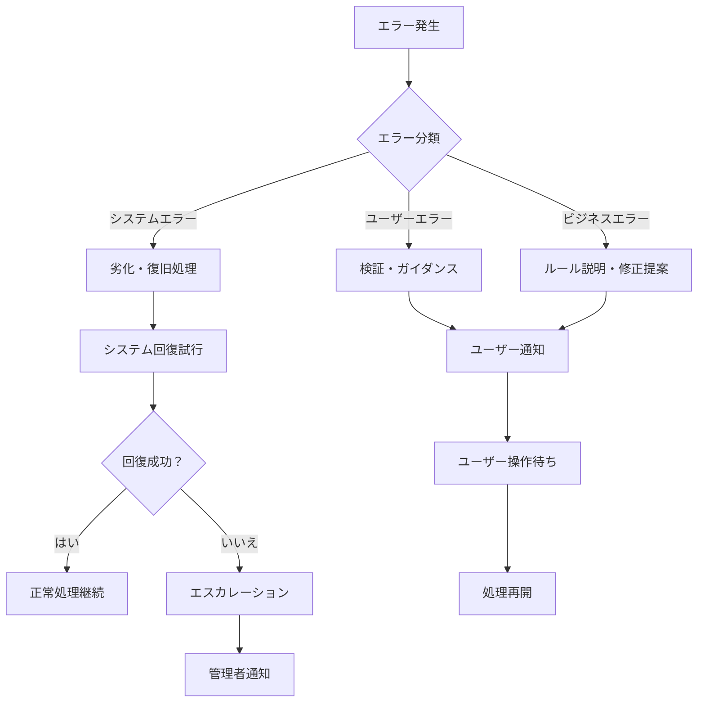

# Technical Design Document

## 概要

この機能は、Vercel AI SDK v5とAI Elementsを活用して、ユーザーのリサーチクエリに対して自動的に情報収集と分析を行う高度なChatUI Research Agentを提供します。

**目的**: ユーザーが複雑なリサーチタスクを自然な会話形式で依頼でき、AIが自動的にWeb検索、情報収集、分析を行って包括的な調査結果を提供する。

**ユーザー**: 研究者、アナリスト、コンテンツ制作者、学生などの情報収集を必要とするユーザーが、効率的なリサーチワークフローを実現するために利用する。

**影響**: 従来の手動検索プロセスから、AIエージェントによる自動化された包括的リサーチプロセスへの転換を実現する。

### 目標
- 自然な会話インターフェースを通じたリサーチクエリ処理
- AI駆動による自動情報収集と分析
- リアルタイムストリーミング応答によるユーザー体験向上
- 信頼性の高い情報源管理と出典表示

### 非目標
- リアルタイム協働編集機能
- 大容量ファイルアップロード機能
- マルチユーザーチャットルーム機能
- 外部システムとの複雑なAPIインテグレーション（第1フェーズでは除外）

## アーキテクチャ

### 高レベルアーキテクチャ



### 技術スタック・設計決定

#### フロントエンド技術
- **React 18**: TypeScript対応、コンポーネントベースUI開発
- **Next.js 15**: App Routerによるモダンフルスタック開発
- **AI Elements**: Vercel公式ChatUIコンポーネントライブラリ
- **Tailwind CSS**: 効率的なスタイリング、AI Elementsとの統合

#### バックエンド・AI技術
- **Vercel AI SDK v5**: マルチプロバイダーAI統合、ストリーミング対応
- **Next.js API Routes**: サーバーサイド処理とAPI統合
- **Node.js**: サーバーサイドJavaScript実行環境

#### 主要設計決定

**決定1: Vercel AI SDK v5の採用**
- **決定**: Vercel AI SDK v5をAI機能の中核として採用
- **コンテキスト**: マルチプロバイダー対応とストリーミング機能が必要
- **代替案**: OpenAI SDK直接利用、LangChain、独自AI統合レイヤー
- **選択したアプローチ**: Vercel AI SDK v5の統合型アプローチ
- **根拠**: 統一されたAPI、フレームワーク統合、ストリーミング対応、将来的なプロバイダー変更への対応力
- **トレードオフ**: 高い柔軟性とメンテナンス性を得る代わりに、特定プロバイダーの独自機能への直接アクセスが制限される

**決定2: AI Elementsによる専用UIコンポーネント**
- **決定**: AI ElementsをChatUIの基盤として採用
- **コンテキスト**: AIチャット特有のUXパターンとリアルタイム更新が必要
- **代替案**: 汎用UIライブラリ（MUI、Chakra UI）、カスタムコンポーネント開発
- **選択したアプローチ**: AI Elements + shadcn/uiベースのカスタマイズ
- **根拠**: AIチャット最適化済み、Vercel AI SDKとの深い統合、高いカスタマイズ性
- **トレードオフ**: AI特化の最適なUXを得る代わりに、新しいライブラリへの学習コストが発生

**決定3: Research Engine分離アーキテクチャ**
- **決定**: リサーチロジックを独立したエンジンとして分離
- **コンテキスト**: 複雑なリサーチ戦略と将来的な機能拡張が必要
- **代替案**: ChatUI内での直接処理、サードパーティリサーチAPI利用
- **選択したアプローチ**: 専用Research Engineによるモジュラー設計
- **根拠**: 責任分離、テスト容易性、将来的な拡張性、独立したスケーリング
- **トレードオフ**: アーキテクチャの複雑性増加と引き換えに、高い保守性と拡張性を実現

## システムフロー

### ユーザーインタラクションフロー



### リサーチプロセスフロー



## 要件トレーサビリティ

| 要件 | 要件概要 | コンポーネント | インターフェース | フロー |
|------|----------|----------------|------------------|--------|
| 1.1-1.4 | ChatUIインターフェース | ChatUI, AI Elements | useChat, Message API | ユーザーインタラクション |
| 2.1-2.4 | Research Agent機能 | Research Agent, Research Engine | ResearchService, ProgressAPI | リサーチプロセス |
| 3.1-3.4 | Vercel AI SDK統合 | AI Integration Layer | StreamingAPI, ModelAPI | SDK統合フロー |
| 4.1-4.4 | AI Elements活用 | Message Thread, Reasoning Panel | ElementsAPI, RenderAPI | UI表示フロー |
| 5.1-5.4 | 情報ソース管理 | Source Manager | SourceAPI, CitationAPI | ソース管理フロー |
| 6.1-6.4 | パフォーマンス・信頼性 | 全コンポーネント | ErrorAPI, HealthAPI | エラー処理フロー |

## コンポーネント・インターフェース

### フロントエンドレイヤー

#### ChatUI Interface

**責任・境界**
- **主要責任**: ユーザーとのチャットインターフェース提供とリアルタイム表示管理
- **ドメイン境界**: ユーザーインタラクションとプレゼンテーション層
- **データ所有権**: UI状態、メッセージ履歴、表示設定
- **トランザクション境界**: フロントエンド状態管理スコープ

**依存関係**
- **インバウンド**: ユーザー操作、ブラウザイベント
- **アウトバウンド**: Research Agent API、AI Elements コンポーネント
- **外部**: なし

**契約定義**

**Service Interface**:
```typescript
interface ChatUIService {
  sendMessage(message: string): Result<MessageResponse, UIError>;
  streamResponse(responseId: string): Result<Stream<ResponseChunk>, UIError>;
  getMessageHistory(): Result<Message[], UIError>;
  clearHistory(): Result<void, UIError>;
}

interface Message {
  id: string;
  role: 'user' | 'assistant';
  content: string;
  timestamp: Date;
  sources?: SourceReference[];
}

interface ResponseChunk {
  id: string;
  content: string;
  isComplete: boolean;
  progress?: ResearchProgress;
}
```

- **事前条件**: ユーザーセッションが有効であること
- **事後条件**: メッセージが履歴に保存され、適切な応答が開始されること
- **不変条件**: メッセージの順序性とユーザー体験の一貫性

#### AI Elements Integration

**責任・境界**
- **主要責任**: AI特化UIコンポーネントの統合と表示最適化
- **ドメイン境界**: AIチャット特有のUI/UXパターン
- **データ所有権**: コンポーネント状態、レンダリング設定
- **トランザクション境界**: コンポーネントライフサイクル

**依存関係**
- **インバウンド**: ChatUI Interface
- **アウトバウンド**: AI Elements ライブラリ、shadcn/ui
- **外部**: AI Elements (@ai-elements/*), shadcn/ui

**契約定義**

**Component Interface**:
```typescript
interface AIElementsService {
  renderMessageThread(messages: Message[]): Result<JSX.Element, RenderError>;
  renderReasoningPanel(reasoning: ReasoningData): Result<JSX.Element, RenderError>;
  renderInputBox(config: InputConfig): Result<JSX.Element, RenderError>;
  handleStreamingUpdate(chunk: ResponseChunk): Result<void, RenderError>;
}

interface ReasoningData {
  steps: ReasoningStep[];
  currentStep: number;
  isComplete: boolean;
}

interface InputConfig {
  placeholder: string;
  onSubmit: (message: string) => void;
  isDisabled: boolean;
}
```

### バックエンドレイヤー

#### Research Agent Core

**責任・境界**
- **主要責任**: リサーチクエリの調整、戦略決定、結果統合
- **ドメイン境界**: リサーチドメインの中核ビジネスロジック
- **データ所有権**: リサーチセッション状態、戦略設定
- **トランザクション境界**: 単一リサーチセッションの整合性

**依存関係**
- **インバウンド**: ChatUI Interface API呼び出し
- **アウトバウンド**: Vercel AI SDK、Research Engine、Source Manager
- **外部**: なし（内部統合のみ）

**契約定義**

**Service Interface**:
```typescript
interface ResearchAgentService {
  processQuery(query: string, sessionId: string): Result<Stream<ResearchProgress>, AgentError>;
  analyzeQueryClarity(query: string): Result<ClarityAnalysis, AgentError>;
  generateClarificationQuestions(query: string): Result<Question[], AgentError>;
  streamResults(researchId: string): Result<Stream<ResearchResult>, AgentError>;
}

interface ResearchProgress {
  stage: 'analyzing' | 'searching' | 'processing' | 'synthesizing' | 'complete';
  progress: number; // 0-100
  currentActivity: string;
  sources?: SourceReference[];
}

interface ClarityAnalysis {
  isComplete: boolean;
  confidence: number;
  missingAspects: string[];
}

interface ResearchResult {
  summary: string;
  sections: ResultSection[];
  sources: SourceReference[];
  confidence: number;
  limitations?: string[];
}
```

- **事前条件**: 有効なセッションIDと非空のクエリ
- **事後条件**: リサーチプロセスが開始され、進行状況がストリーミング配信される
- **不変条件**: セッション内でのリサーチ結果の一貫性

#### Vercel AI SDK Integration

**責任・境界**
- **主要責任**: AI SDKの統合、モデル呼び出し、ストリーミング管理
- **ドメイン境界**: AI/LLMとのインターフェース層
- **データ所有権**: AIセッション状態、プロバイダー設定
- **トランザクション境界**: AI API呼び出しの原子性

**依存関係**
- **インバウンド**: Research Agent Core、ChatUI Interface
- **アウトバウンド**: LLMプロバイダー（OpenAI、Anthropic等）
- **外部**: Vercel AI SDK (@ai-sdk/core, @ai-sdk/react)

**外部依存関係調査**:
- **Vercel AI SDK**: ストリーミング、ツール呼び出し、マルチプロバイダー対応を確認済み
- **認証方式**: API キーベース認証、プロバイダー別設定
- **レート制限**: プロバイダー依存、SDK側でのリトライ機能あり
- **バージョン互換性**: v5.0以降、後方互換性は限定的
- **パフォーマンス**: ストリーミング応答で低レイテンシー実現

**契約定義**

**Service Interface**:
```typescript
interface AISDKService {
  generateResponse(prompt: string, context: ResearchContext): Result<Stream<string>, AIError>;
  analyzeQuery(query: string): Result<QueryAnalysis, AIError>;
  structureResults(data: ResearchData): Result<StructuredResult, AIError>;
  cancelGeneration(sessionId: string): Result<void, AIError>;
}

interface ResearchContext {
  sessionId: string;
  previousMessages: Message[];
  researchData?: ResearchData;
}

interface QueryAnalysis {
  intent: 'research' | 'clarification' | 'summary';
  complexity: 'simple' | 'moderate' | 'complex';
  requiredSources: SourceType[];
  estimatedDuration: number;
}
```

#### Research Engine

**責任・境界**
- **主要責任**: Web検索、情報収集、データ処理の実行
- **ドメイン境界**: 情報検索・処理ドメイン
- **データ所有権**: 検索結果、処理済み情報、一時キャッシュ
- **トランザクション境界**: 単一検索・処理操作の整合性

**依存関係**
- **インバウンド**: Research Agent Core
- **アウトバウンド**: Web Search APIs、Information Processor
- **外部**: 検索API（要調査）、スクレイピングツール

**外部依存関係調査**:
- **検索API**: Google Search API、Bing Search API、Tavily等の比較検討が必要
- **実装時調査必要**: 具体的なAPI選定、認証フロー、レート制限対応
- **スクレイピング**: Puppeteer/Playwright等のツール選定が必要

**契約定義**

**Service Interface**:
```typescript
interface ResearchEngineService {
  executeSearch(query: string, params: SearchParams): Result<Stream<SearchResult>, EngineError>;
  processInformation(sources: Source[]): Result<ProcessedInformation, EngineError>;
  evaluateSourceReliability(source: Source): Result<ReliabilityScore, EngineError>;
}

interface SearchParams {
  maxResults: number;
  sourceTypes: SourceType[];
  timeframe?: string;
  language: string;
}

interface ProcessedInformation {
  extractedContent: ContentBlock[];
  keyPoints: string[];
  relationships: ConceptRelation[];
}
```

#### Source Manager

**責任・境界**
- **主要責任**: 情報源の管理、信頼性評価、引用生成
- **ドメイン境界**: 情報の出典・品質管理
- **データ所有権**: ソース情報、信頼性データ、引用形式
- **トランザクション境界**: ソース情報の整合性

**依存関係**
- **インバウンド**: Research Engine、Research Agent Core
- **アウトバウンド**: なし（ドメインサービス）
- **外部**: なし

**契約定義**

**Service Interface**:
```typescript
interface SourceManagerService {
  registerSource(source: RawSource): Result<SourceReference, SourceError>;
  evaluateReliability(sourceId: string): Result<ReliabilityAssessment, SourceError>;
  generateCitation(sourceId: string, format: CitationFormat): Result<string, SourceError>;
  getSourcesByReliability(threshold: number): Result<SourceReference[], SourceError>;
}

interface SourceReference {
  id: string;
  url: string;
  title: string;
  author?: string;
  publishedDate?: Date;
  reliability: ReliabilityScore;
  extractedContent: string;
}

interface ReliabilityAssessment {
  score: number; // 0-1
  factors: ReliabilityFactor[];
  confidence: number;
  warnings?: string[];
}
```

## データモデル

### ドメインモデル

**コアコンセプト**:
- **ResearchSession**: リサーチセッションの集約ルート、トランザクション境界
- **Query**: ユーザークエリエンティティ、意図と文脈を管理
- **ResearchResult**: リサーチ結果の価値オブジェクト、不変性保証
- **SourceReference**: 情報源参照、信頼性情報を包含

**ビジネスルール・不変条件**:
- セッション内でのクエリとその結果の対応関係は必須
- ソースの信頼性スコアは0-1の範囲で制約
- リサーチ結果は最低1つの検証可能なソースを持つ必要がある
- ユーザーのプライベート情報はセッション終了時に削除される



### 論理データモデル

**構造定義**:
- ResearchSession (1) : Query (N) - セッション内マルチクエリ対応
- Query (1) : ResearchResult (1) - 1対1結果生成
- ResearchResult (N) : SourceReference (M) - 多対多引用関係
- User (1) : ResearchSession (N) - ユーザー別セッション管理

**整合性・完全性**:
- 参照整合性: 全外部キー関係の強制
- カスケード削除: セッション削除時の関連データ完全削除
- 時系列整合性: タイムスタンプの論理的順序保証

### 物理データモデル

**Key-Value Store（Redis）選択根拠**:
- 高速セッション状態管理
- ストリーミングデータの一時保存
- TTL機能によるプライバシー保護

**セッション管理**:
```typescript
interface SessionData {
  sessionId: string;
  userId: string;
  messages: Message[];
  currentQuery?: Query;
  researchState: ResearchState;
  ttl: number; // 24時間自動削除
}
```

**検索結果キャッシュ**:
```typescript
interface SearchCache {
  queryHash: string;
  results: SearchResult[];
  sources: SourceReference[];
  cachedAt: Date;
  ttl: number; // 1時間キャッシュ
}
```

### データ契約・統合

**APIデータ転送**:
- JSON形式による標準化されたAPI通信
- GraphQL風のクエリベース部分取得対応
- ストリーミングデータのNDJSON形式

**イベントスキーマ**:
- 研究進行状況イベントの定義
- ソース発見・評価イベント
- 結果生成完了イベント

**クロスサービスデータ管理**:
- Sagaパターンによる分散トランザクション
- 最終的整合性による柔軟な結合度
- イベントソーシングによる状態変更トラッキング

## エラーハンドリング

### エラー戦略

**階層化エラーハンドリング**による包括的エラー管理を実装。各レイヤーで適切な抽象化レベルでエラーを処理し、上位レイヤーに意味のある情報を提供する。

### エラーカテゴリと対応

**ユーザーエラー（4xx）**:
- **無効入力**: フィールドレベル検証、具体的改善提案
- **認証エラー**: 認証ガイダンス、再認証フロー
- **リソース未発見**: ナビゲーション支援、代替案提示

**システムエラー（5xx）**:
- **インフラ障害**: グレースフル劣化、代替サービス切替
- **タイムアウト**: サーキットブレーカー、指数バックオフ
- **リソース枯渇**: レート制限、優先度制御

**ビジネスロジックエラー（422）**:
- **ルール違反**: 条件説明、修正ガイダンス
- **状態競合**: トランザクション再試行、楽観ロック

**プロセスフロー可視化**:



### 監視

**エラートラッキング**: Structured logging、エラー分類タグ、コンテキスト情報
**ヘルスモニタリング**: 各サービスの生存性監視、依存性チェック、レスポンス時間測定
**アラート設定**: 閾値ベース通知、異常検知、エスカレーションルール

## テスト戦略

### ユニットテスト
- **Research Agent Core**: クエリ分析、戦略決定ロジック、結果統合処理
- **Source Manager**: 信頼性評価アルゴリズム、引用生成、ソース管理
- **AI SDK Integration**: プロンプト生成、レスポンス解析、エラー処理
- **Information Processor**: データ抽出、構造化、品質評価
- **Search Query Builder**: 検索クエリ最適化、パラメータ設定

### インテグレーションテスト
- **AI SDK - LLMプロバイダー**: 各プロバイダーとの通信、ストリーミング処理
- **Research Engine - Search APIs**: 検索API統合、結果解析、エラーハンドリング
- **ChatUI - Research Agent**: UI応答性、ストリーミング表示、状態同期
- **データフロー統合**: セッション管理、履歴保存、キャッシュ整合性
- **エラー伝播**: 各レイヤー間のエラーハンドリング連携

### E2E/UIテスト
- **基本リサーチフロー**: クエリ入力→検索→結果表示の完全なユーザージャーニー
- **ストリーミング体験**: リアルタイム進行状況表示、インクリメンタル結果更新
- **エラーシナリオ**: ネットワーク障害、API制限、無効入力への対応
- **レスポンシブUI**: モバイル/デスクトップでのユーザビリティ
- **アクセシビリティ**: キーボードナビゲーション、スクリーンリーダー対応

### パフォーマンス/負荷テスト
- **同時セッション処理**: 100並行セッション、メモリ使用量監視
- **ストリーミング性能**: 低レイテンシー応答、バックプレッシャー制御
- **検索API制限**: レート制限下での処理能力、キューイング効果
- **大容量結果処理**: 長文リサーチ結果、複数ソース統合性能

## パフォーマンス・スケーラビリティ

### ターゲットメトリクス・測定戦略

**応答時間目標**:
- 初期応答: 5秒以内（要件6.2）
- ページ読み込み: 3秒以内（要件6.1）  
- ストリーミング遅延: 100ms以内
- 検索結果取得: 10秒以内

**スループット目標**:
- 同時アクティブセッション: 500セッション
- 1日あたりクエリ処理: 50,000クエリ
- API呼び出し成功率: 99.5%

### スケーリングアプローチ

**水平スケーリング**:
- Next.js Serverless Functions による自動スケーリング
- Redis Cluster によるセッションデータ分散
- CDNによる静的リソース配信最適化

**垂直スケーリング**:
- メモリ最適化: ストリーミングバッファサイズ調整
- CPU最適化: 並列処理、ワーカープール活用

### キャッシング戦略・最適化技術

**多層キャッシング**:
- **L1 (メモリ)**: アクティブセッション状態、頻用クエリ結果
- **L2 (Redis)**: 検索結果、ソース情報、分析済みクエリ
- **L3 (CDN)**: 静的リソース、汎用検索結果

**最適化技術**:
- 予測的プリフェッチング: 関連クエリの事前準備
- 結果部分配信: 重要セクション優先表示
- 適応的バッチング: API呼び出し最適化
- インテリジェントキャッシング: 使用頻度ベースTTL調整

## セキュリティ考慮事項

### 脅威モデリング

**主要脅威**:
- **注入攻撃**: プロンプトインジェクション、クエリインジェクション
- **情報漏洩**: 検索履歴、個人情報、API キー露出
- **サービス拒否**: 大量リクエスト、リソース枯渇攻撃
- **認証バイパス**: セッションハイジャック、権限昇格

### セキュリティ制御

**認証・認可パターン**:
- JWT ベースセッション管理、トークン更新機能
- レート制限: ユーザー別、IP別、エンドポイント別
- 入力検証: クエリサニタイゼーション、SQLi/XSS防止

**データ保護・プライバシー考慮事項**:
- **暗号化**: API通信はHTTPS、機密データはAES-256
- **データ最小化**: 必要最小限の情報収集、自動削除設定
- **匿名化**: 検索ログの個人識別情報除去
- **GDPR対応**: データ削除権、ポータビリティ権の実装