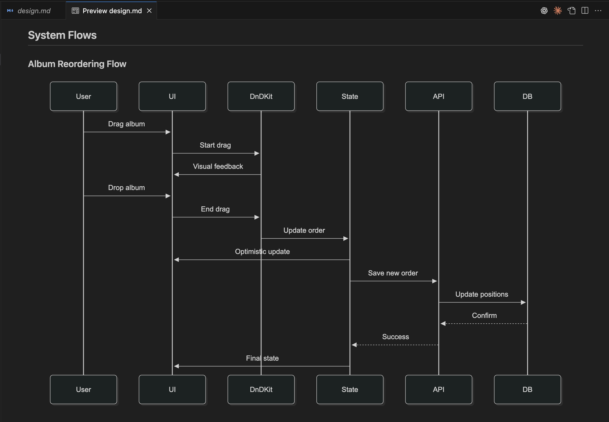

<div align="center" style="font-size: 1rem; margin-bottom: 1rem;"><sub>
<a href="./tools/cc-sdd/README.md">English</a> | <a href="./tools/cc-sdd/README_ja.md">日本語</a> | <a href="./tools/cc-sdd/README_zh-TW.md">繁體中文</a>
</sub></div>

# cc-sdd / prev. Claude Code Spec

✨ **Transform Claude Code/ Cursor IDE / Gemini CLI from prototype to production-ready development**

<!-- npm badges -->
[](https://www.npmjs.com/package/cc-sdd?activeTab=readme)
[](https://packagephobia.com/result?p=cc-sdd)
[](tools/cc-sdd/LICENSE)


One command installs **AI-DLC** (AI-Driven Development Life Cycle) with **SDD** (Spec-Driven Development) workflows for Claude Code, Cursor IDE and Gemini CLI.

## 🚀 Quick Start

```bash
# Basic installation (default: Claude Code)
npx cc-sdd@latest

# With language: --lang en|ja|zh-TW|zh|es|pt|de|fr|ru|it|ko|ar
# With OS: --os mac | --os windows | --os linux (if auto-detection fails)
npx cc-sdd@latest --lang ja --os mac

# With different agents: gemini-cli, cursor
npx cc-sdd@latest --gemini-cli
npx cc-sdd@latest --cursor

# Ready to go! Now Claude Code and Gemini CLI can leverage `/kiro:spec-init <what to build>` and the full SDD workflow
```

## ✨ What You Get

After running cc-sdd, you'll have:

- **10 powerful slash commands** (`/kiro:steering`, `/kiro:spec-requirements`, `/kiro:validate-gap`, etc.)
- **Project Memory (steering)** - AI learns your codebase, patterns, and preferences
- **Structured AI-DLC workflow** with quality gates and approvals
- **Spec-Driven Development** methodology built-in
- **Kiro IDE compatibility** for seamless spec management

**Perfect for**: Feature development, code reviews, technical planning, and maintaining development standards across your team.

## 🌐 Supported Languages

- English (`en`)
- Japanese (`ja`)
- Traditional Chinese (`zh-TW`)
- Chinese (`zh`)
- Spanish (`es`)
- Portuguese (`pt`)
- German (`de`)
- French (`fr`)
- Russian (`ru`)
- Italian (`it`)
- Korean (`ko`)
- Arabic (`ar`)


---

## About

Brings to Claude Code, Cursor IDE and Gemini CLI your project context, Project Memory (steering) and development patterns: **requirements → design → tasks → implementation**. **Kiro IDE compatible** — Reuse Kiro-style SDD specs and workflows seamlessly.

**【Claude Code/Cursor IDE/Gemini CLI】**
ワンライナーで **AI-DLC（AI-Driven Development Life Cycle）** と **Spec-Driven Development（仕様駆動開発）** のワークフローを導入。プロジェクト直下に **10個のSlash Commands** 一式と設定ファイル（Claude Code用の **CLAUDE.md** / Cursor IDE用の **AGENTS.md** / Gemini CLI用の **GEMINI.md**）を配置、プロジェクトの文脈と開発パターン（**要件 → 設計 → タスク → 実装**）、**プロジェクトメモリ（ステアリング）** を含む。

📝 **関連記事**  
**[Kiroの仕様書駆動開発プロセスをClaude Codeで徹底的に再現した](https://zenn.dev/gotalab/articles/3db0621ce3d6d2)** - Zenn記事

## Languages
> 📖 **Project Overview** (Spec-Driven Development workflow)
- 日本語: [README_ja.md](tools/cc-sdd/README_ja.md)
- English: [README.md](tools/cc-sdd/README.md)
- 繁體中文: [README_zh-TW.md](tools/cc-sdd/README_zh-TW.md)

**Transform your agentic development workflow with Spec-Driven Development**

---

## 🤖 Supported Coding Agents

- **✅ Claude Code** - Fully supported with all 10 custom slash commands and CLAUDE.md
- **✅ Gemini CLI** - Fully supported with all 10 custom commands and GEMINI.md
- **✅ Cursor IDE** - Fully supported with all 10 custom commands and AGENTS.md
- **📅 More agents** - Additional AI coding assistants planned

*Currently optimized for Claude Code. Use `--agent claude-code` (default) for full functionality.*
 
## 📋 AI-DLC Workflow

### For New Projects
```bash
# Start spec-driven development immediately
/kiro:spec-init User authentication with OAuth and 2FA
/kiro:spec-requirements user-auth
/kiro:spec-design user-auth -y
/kiro:spec-tasks user-auth -y
/kiro:spec-impl user-auth 1.1,1.2,1.3
```

📁 **Example Spec**: See [photo-albums-en](.kiro/specs/photo-albums-en/) for a complete spec-driven development example with requirements, design, and tasks.



### For Existing Projects (Recommended)
```bash
# First establish project context
/kiro:steering                                    # AI learns existing project context

# Then proceed with development
/kiro:spec-init Add OAuth to existing auth system
/kiro:spec-requirements oauth-enhancement
/kiro:validate-gap oauth-enhancement              # Optional: analyze existing vs requirements
/kiro:spec-design oauth-enhancement -y
/kiro:validate-design oauth-enhancement           # Optional: validate design integration
/kiro:spec-tasks oauth-enhancement -y
/kiro:spec-impl oauth-enhancement 1.1,1.2,1.3
```

**Quality Gates**: Each phase requires human approval before proceeding (use `-y` to auto-approve).

**Specs as Foundation**: Based on [Kiro's proven methodology](https://kiro.dev/docs/specs/) - specs transform ad-hoc development into systematic workflows. Created specs are portable to [Kiro IDE](https://kiro.dev) for enhanced implementation guardrails and team collaboration.


## 🎯 Advanced Options

```bash
# Choose language and OS
npx cc-sdd@latest --lang ja --os mac

# Preview changes before applying
npx cc-sdd@latest --dry-run

# Safe update with backup
npx cc-sdd@latest --backup --overwrite force

# Custom specs directory
npx cc-sdd@latest --kiro-dir docs/specs
```

## Features

✅ **AI-DLC Integration** - Complete AI-Driven Development Life Cycle  
✅ **Project Memory** - Steering documents that maintain comprehensive context (architecture, patterns, rules, domain knowledge) across all sessions  
✅ **Spec-Driven Development** - Structured requirements → design → tasks → implementation  
✅ **Cross-Platform** - macOS, Linux, and Windows support with auto-detection (Linux reuses mac templates)  
✅ **Multi-Language** - Japanese, English, Traditional Chinese  
✅ **Safe Updates** - Interactive prompts with backup options  

## 📚 Related Resources

📝 **Related Articles**  
**[Kiroの仕様書駆動開発プロセスをClaude Codeで徹底的に再現した](https://zenn.dev/gotalab/articles/3db0621ce3d6d2)** - Zenn Article (Japanese)

🎯 **Presentations**  
**[Claude Codeは仕様駆動の夢を見ない](https://speakerdeck.com/gotalab555/claude-codehashi-yang-qu-dong-nomeng-wojian-nai)** - Speaker Deck Presentation (Japanese)

## 📦 Package Information

This repository contains the **cc-sdd** NPM package located in [`tools/cc-sdd/`](tools/cc-sdd/).

For detailed documentation, installation instructions, and usage examples, see:
- [**Tool Documentation**](tools/cc-sdd/README.md) - Complete cc-sdd tool guide
- [**Japanese Documentation**](tools/cc-sdd/README_ja.md) - 日本語版ツール説明

## Project Structure

```
claude-code-spec/
├── tools/cc-sdd/              # Main cc-sdd NPM package
│   ├── src/                   # TypeScript source code
│   ├── templates/             # Agent templates (Claude Code, Cursor IDE, Gemini CLI)
│   ├── package.json           # Package configuration
│   └── README.md              # Tool documentation
├── docs/                      # Documentation
├── .claude/                   # Example Claude Code commands
├── .gemini/                   # Example Gemini CLI commands
├── README.md                  # This file (English)
├── README_ja.md               # Japanese project README
└── README_zh-TW.md            # Traditional Chinese project README
```


## License

MIT License
