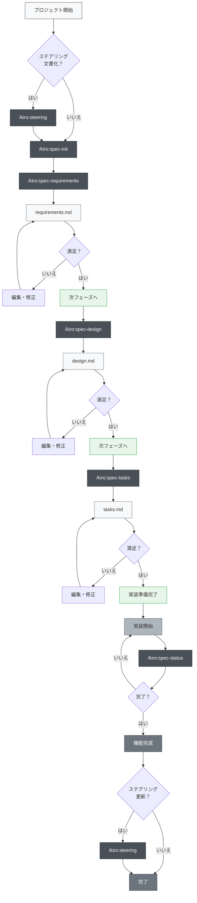
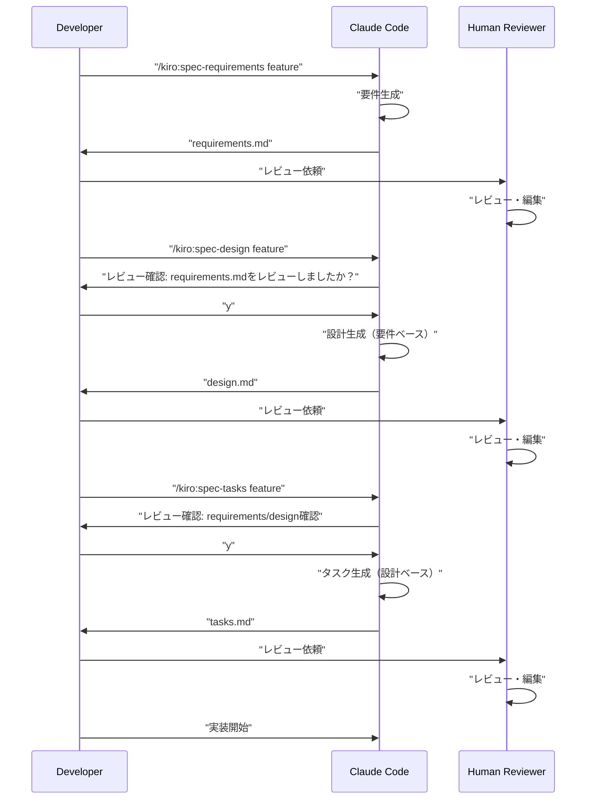

# Multi-Platform Spec-Driven Development

> 🌐 **Language**  
> 📖 **[English Version](README_en.md)** | 📖 **日本語版 README** (このページ) | 📖 **[繁體中文說明](README_zh-TW.md)**

> 🚀 **対応プラットフォーム**  
> 🤖 **Claude Code** | 🔮 **Cursor** | ⚡ **Gemini CLI** | 🧠 **Codex CLI**

> [!Warning]
> 初期バージョンのため、使いながら適宜改善していく予定

📝 **関連記事**  
**[Kiroの仕様書駆動開発プロセスをClaude Codeで徹底的に再現した](https://zenn.dev/gotalab/articles/3db0621ce3d6d2)** - Zenn記事

Claude Code、Cursor、Gemini CLI、Codex CLIの4つのプラットフォームに対応したSpec-Driven Developmentツールセット。Kiro IDEに組み込まれているSpec-Driven Developmentを各プラットフォームで実践するためのプロジェクト。

**Kiro IDEと高い互換性** — 既存のKiro流SDDの仕様・ワークフロー・ディレクトリ構成をそのまま活用できます。

## 概要

このプロジェクトは、複数のAI開発プラットフォーム（Claude Code、Cursor、Gemini CLI、Codex CLI）に対応したSlash Commandsを活用して、仕様駆動開発（Spec-Driven Development）を効率的に行うためのツールセットを提供します。各開発フェーズで適切なコマンドを使用することで、プラットフォームを問わず体系的かつ品質の高い開発プロセスを実現できます。

## セットアップ

### 自分のプロジェクトに導入する

お使いのプラットフォームに応じて、対応するディレクトリをコピーするだけで導入できます：

#### プラットフォーム別ディレクトリ
- **🤖 Claude Code**: `.claude/commands/` - Claude Code用のSlash Commands定義
- **🔮 Cursor**: `.cursor/commands/` - Cursor用のコマンド定義  
- **⚡ Gemini CLI**: `.gemini/commands/` - Gemini CLI用のTOMLファイル
- **🧠 Codex CLI**: `.codex/commands/` - OpenAI Codex用のプロンプト定義

#### 共通設定ファイル
- **設定ファイル**: プラットフォームに応じた設定ファイル（`CLAUDE.md`、`AGENTS.md`等）をコピー


### 初回セットアップ手順

1. **プラットフォーム選択**: お使いのAI開発環境に応じたディレクトリをコピー
2. **設定ファイル調整**: プラットフォーム固有の設定ファイルをプロジェクトに合わせて調整
3. **最初のコマンドを実行** (プラットフォーム共通):
   ```bash
   # オプション: ステアリング文書を作成
   /kiro:steering
   
   # 最初の機能仕様を作成
   /kiro:spec-init "あなたのプロジェクトの詳細な説明"
   ```

### マルチプラットフォーム対応ディレクトリ構造

コマンドを実行すると、以下のディレクトリが自動的に作成されます：

```
あなたのプロジェクト/
├── プラットフォーム別ディレクトリ（使用するものをコピー）
│   ├── .claude/commands/      # Claude Code用コマンド定義
│   ├── .cursor/commands/      # Cursor用コマンド定義
│   ├── .gemini/commands/      # Gemini CLI用TOML設定
│   └── .codex/commands/       # Codex CLI用プロンプト定義
├── .kiro/
│   ├── steering/              # 自動生成されるステアリング文書
│   └── specs/                 # 自動生成される機能仕様
├── プラットフォーム別設定ファイル
│   ├── CLAUDE.md              # Claude Code設定
│   ├── CLAUDE_en.md           # 英語版 Claude Code設定
│   ├── CLAUDE_zh-TW.md        # 繁体字版 Claude Code設定
│   └── AGENTS.md              # Cursor用設定
├── README.md                  # 日本語版 README
├── README_en.md               # 英語版 README
├── README_zh-TW.md            # 繁体字版 README
└── （あなたのプロジェクトファイル）
```

## 使い方

### 1. 新規プロジェクトの場合

```bash
# オプション: プロジェクトステアリング生成（推奨だが必須ではない）
/kiro:steering

# ステップ1: 新機能の仕様作成開始（詳細な説明を含める）
/kiro:spec-init "ユーザーがPDFをアップロードして、その中の図表を抽出し、AIが内容を説明する機能を作りたい。技術スタックはNext.js、TypeScript、Tailwind CSSを使用。"

# ステップ2: 要件定義（自動生成されたfeature-nameを使用）
/kiro:spec-requirements pdf-diagram-extractor
# → .kiro/specs/pdf-diagram-extractor/requirements.md をレビュー・編集

# ステップ3: 技術設計（インタラクティブ承認）
/kiro:spec-design pdf-diagram-extractor
# → "requirements.mdをレビューしましたか？ [y/N]" に応答
# → .kiro/specs/pdf-diagram-extractor/design.md をレビュー・編集

# ステップ4: タスク生成（インタラクティブ承認）
/kiro:spec-tasks pdf-diagram-extractor
# → requirements と design のレビュー確認に応答
# → .kiro/specs/pdf-diagram-extractor/tasks.md をレビュー・編集

# ステップ5: 実装開始
```

### 2. 既存プロジェクトへの機能追加

```bash
# オプション: ステアリング作成・更新
# 新規作成の場合も、更新の場合も同じコマンドを使用
/kiro:steering

# ステップ1: 新機能の仕様作成開始
/kiro:spec-init "新しい機能の詳細な説明をここに記述"
# 以降は新規プロジェクトと同じ
```

### 3. 進捗確認

```bash
# 特定機能の進捗確認
/kiro:spec-status my-feature

# 現在のフェーズ、承認状況、タスク進捗が表示される
```

## Spec-Driven Development プロセス

### プロセスフロー図

このフローでは、各フェーズで「レビュー・承認」が必要となる。

**ステアリング文書**は、プロジェクトに関する永続的な知識（アーキテクチャ、技術スタック、コード規約など）を記録するドキュメントです。作成・更新はオプションだが、プロジェクトの長期的な保守性を高めるために推奨される。



## スラッシュコマンド一覧

### 🚀 Phase 0: プロジェクトステアリング（オプション）

| コマンド | 用途 | 使用タイミング |
|---------|------|---------------|
| `/kiro:steering` | ステアリング文書のスマート作成・更新 | すべての場面（新規・更新どちらも） |
| `/kiro:steering-custom` | カスタムステアリング文書の作成 | 特殊な規約やガイドラインが必要な時 |

**注意**: ステアリング文書は推奨されるが必須ではない。小規模な機能追加や試験的な開発では省略可能。

#### ステアリング文書の種類
- **product.md**: プロダクト概要、機能、ユースケース
- **tech.md**: アーキテクチャ、技術スタック、開発環境
- **structure.md**: ディレクトリ構造、コード規約、命名規則
- **カスタム文書**: API規約、テスト方針、セキュリティポリシー等

### 📋 Phase 1: 仕様作成

| コマンド | 用途 | 使用タイミング |
|---------|------|---------------|
| `/kiro:spec-init [詳細なプロジェクト説明]` | プロジェクト説明から仕様構造を初期化 | 新機能開発開始時 |
| `/kiro:spec-requirements [feature-name]` | 要件定義書の生成 | 仕様初期化後すぐ |
| `/kiro:spec-design [feature-name]` | 技術設計書の生成 | 要件承認後 |
| `/kiro:spec-tasks [feature-name]` | 実装タスクの生成 | 設計承認後 |

### 📊 Phase 2: 進捗管理

| コマンド | 用途 | 使用タイミング |
|---------|------|---------------|
| `/kiro:spec-status [feature-name]` | 現在の進捗とフェーズ確認 | 開発中随時 |

## 3フェーズ承認ワークフロー

このシステムの核心は、各フェーズで人間によるレビューと承認を必須とする



## ベストプラクティス

### ✅ 推奨事項

1. **常にステアリングから開始**
   - すべての場面で `/kiro:steering` を使用（スマートに新規作成・更新を判断）
   - 統合コマンドは既存ファイルを保護しつつ適切に処理

2. **フェーズを飛ばさない**
   - 要件 → 設計 → タスクの順序を厳守
   - 各フェーズで必ず人間によるレビューを実施

3. **定期的な進捗確認**
   - `/kiro:spec-status` で現在の状況を把握
   - タスクの完了状況を適切に更新

4. **ステアリングの保守**
   - 大きな変更後は `/kiro:steering` を実行（自動的に更新を判断）
   - プロジェクトの成長に合わせて更新

### ❌ 避けるべきこと

1. **承認なしでの次フェーズ移行**
   - プロンプトへの確認応答を忘れない

2. **ステアリング文書の放置**
   - 古い情報は開発の妨げになる

3. **タスクステータスの未更新**
   - 進捗が不明確になり管理が困難に

## プロジェクト構造

```
.
├── マルチプラットフォーム対応ディレクトリ
│   ├── .claude/commands/kiro/     # Claude Code用コマンド
│   │   ├── spec-init.md
│   │   ├── spec-requirements.md
│   │   ├── spec-design.md
│   │   ├── spec-tasks.md
│   │   ├── spec-status.md
│   │   ├── spec-impl.md
│   │   ├── steering.md
│   │   └── steering-custom.md
│   ├── .cursor/commands/kiro/     # Cursor用コマンド
│   │   ├── spec-init.md
│   │   ├── spec-requirements.md
│   │   ├── spec-design.md
│   │   ├── spec-tasks.md
│   │   ├── spec-status.md
│   │   └── spec-impl.md
│   ├── .gemini/commands/kiro/     # Gemini CLI用TOML
│   │   ├── spec-init.toml
│   │   ├── spec-requirements.toml
│   │   ├── spec-design.toml
│   │   ├── spec-tasks.toml
│   │   ├── spec-status.toml
│   │   └── spec-impl.toml
│   └── .codex/commands/           # Codex CLI用プロンプト
│       ├── spec-init.md
│       ├── spec-requirements.md
│       ├── spec-design.md
│       ├── spec-tasks.md
│       └── spec-impl.md
├── .kiro/                         # 共通仕様管理ディレクトリ
│   ├── steering/                  # ステアリング文書
│   │   ├── product.md
│   │   ├── tech.md
│   │   └── structure.md
│   └── specs/                     # 機能仕様
│       └── [feature-name]/
│           ├── spec.json          # フェーズ承認状態
│           ├── requirements.md    # 要件定義書
│           ├── design.md         # 技術設計書
│           └── tasks.md          # 実装タスク
├── プラットフォーム別設定ファイル
│   ├── CLAUDE.md                  # Claude Code設定（メイン）
│   ├── CLAUDE_en.md               # 英語版 Claude Code設定
│   ├── CLAUDE_zh-TW.md            # 繁体字版 Claude Code設定
│   └── AGENTS.md                  # Cursor用設定
├── README.md                      # 日本語版 README
├── README_en.md                   # 英語版 README
├── README_zh-TW.md                # 繁体字版 README
└── （あなたのプロジェクトファイル）
```

## プラットフォーム別特徴

### 🤖 Claude Code
- フック機能による自動化（タスク進捗追跡、仕様遵守チェック）
- CLAUDE.mdによる永続的コンテキスト管理
- 豊富なSlash Commands機能

### 🔮 Cursor
- AGENTS.mdによるエージェント設定
- IDE統合による直接コード生成
- ビジュアルなインターフェース

### ⚡ Gemini CLI  
- TOML設定ファイルによる構造化定義
- Google AIとの直接統合
- 高速レスポンス

### 🧠 Codex CLI
- GPT-5対応の高度なプロンプト設計
- 省略防止機能による完全出力
- OpenAI APIとの直接連携

## トラブルシューティング

### コマンドが動作しない場合
1. プラットフォーム対応ディレクトリの存在を確認
   - Claude Code: `.claude/commands/`
   - Cursor: `.cursor/commands/`
   - Gemini CLI: `.gemini/commands/`
   - Codex CLI: `.codex/commands/`
2. コマンドファイルの命名規則を確認
3. 各プラットフォームの最新バージョンを使用しているか確認

### 承認フローで詰まった場合
1. レビュー確認プロンプトに正しく応答しているか確認
2. 前フェーズの承認が完了しているか確認
3. `/kiro:spec-status` で現在の状態を診断
4. 必要に応じて `spec.json` を手動で確認・編集

## まとめ

マルチプラットフォーム対応のSpec-Driven Developmentにより、以下が実現できます：

- 📐 体系的な開発プロセス
- ✅ 品質保証のための段階的承認
- 📊 透明性の高い進捗管理
- 🔄 継続的なドキュメント更新
- 🤖 AIアシストによる効率化
- 🚀 **複数プラットフォーム対応** - お好みの開発環境で同一ワークフロー

Claude Code、Cursor、Gemini CLI、Codex CLIのいずれを使用していても、同じ高品質な開発プロセスを実現できます。プラットフォーム固有の特徴を活かしながら、統一された仕様駆動開発を体験してください。