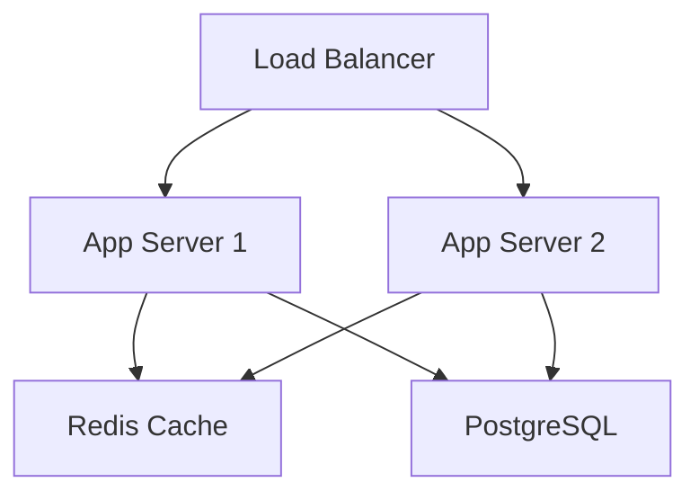

# MVP Evolution to Production

Transform the MVP into a scalable product.

## 🎯 Mission: From "It Works" to "It Scales"

### Evolution Stages
1. **Architecture** - Introduce proper structure
2. **Testing** - Build test pyramid
3. **Operations** - Add monitoring/logging
4. **Documentation** - Make it maintainable
5. **Scaling** - Prepare for growth

## Task: Systematic Evolution

### Step 0: Read Project Context
**Load existing specifications to understand project state:**

1. **Find the active project**:
   - List all directories in `.kiro/specs/`
   - If only one project exists: Use that project
   - If multiple projects exist:
     - List all project names with their descriptions (from 01-init.md)
     - If $2 != "-y": Prompt user to select project
     - If $2 == "-y": Use the most recently modified project
   - If no projects exist: ERROR - Must run `/kiro-rapid:01-init` first

2. **Read all previous phase documentation**:
   - Read `.kiro/specs/[project-name]/01-init.md` - Project foundation
   - Read `.kiro/specs/[project-name]/02-demo.md` - Implemented features
   - Read `.kiro/specs/[project-name]/06-lock.md` - MVP scope
   - Read `.kiro/specs/[project-name]/07-contract.md` - API contracts (if exists)
   - Read `.kiro/specs/[project-name]/08-core-test.md` - Test coverage (if exists)
   - Read `.kiro/specs/[project-name]/09-refactor.md` - Refactoring done (if exists)
   - Compile complete MVP state and readiness assessment

3. **Build context summary** for evolution planning

### 1. Assess Current State

Evaluate the MVP:

```javascript
// mvp-assessment.js
const assessment = {
  metrics: {
    users: getCurrentUserCount(),
    dailyActiveUsers: getDailyActiveUsers(),
    dataVolume: getDatabaseSize(),
    responseTime: getAverageResponseTime(),
    errorRate: getErrorRate()
  },

  technicalDebt: {
    critical: [
      'No authentication system',
      'Hardcoded configurations',
      'No database migrations'
    ],
    major: [
      'Code duplication',
      'No dependency injection',
      'Mixed concerns'
    ],
    minor: [
      'Inconsistent naming',
      'No linting rules',
      'Missing types'
    ]
  },

  readiness: {
    canHandle10xUsers: false,
    canHandle24x7: false,
    canHandleTeamOf5: false
  }
};

console.log('MVP Assessment:', assessment);
```

### 2. Architecture Evolution

Introduce proper structure:

```javascript
// BEFORE: everything.js (MVP style)
// All code in one file

// AFTER: proper structure
/*
src/
├── api/
│   ├── routes/
│   │   ├── auth.routes.js
│   │   ├── items.routes.js
│   │   └── index.js
│   ├── middleware/
│   │   ├── auth.middleware.js
│   │   └── validation.middleware.js
│   └── controllers/
│       ├── auth.controller.js
│       └── items.controller.js
├── services/
│   ├── auth.service.js
│   ├── database.service.js
│   └── cache.service.js
├── models/
│   ├── user.model.js
│   └── item.model.js
├── utils/
│   ├── logger.js
│   └── validator.js
├── config/
│   └── index.js
└── app.js
*/

// Example refactored controller
class ItemController {
  constructor(itemService, cacheService) {
    this.itemService = itemService;
    this.cacheService = cacheService;
  }

  async getItems(req, res, next) {
    try {
      const cached = await this.cacheService.get('items');
      if (cached) return res.json(cached);

      const items = await this.itemService.findAll();
      await this.cacheService.set('items', items);

      res.json(items);
    } catch (error) {
      next(error);
    }
  }
}
```

### 3. Database Evolution

Add proper database management:

```javascript
// database-evolution.js

// Add migrations
const migrations = [
  {
    version: '001',
    up: `
      CREATE TABLE IF NOT EXISTS users (
        id INTEGER PRIMARY KEY AUTOINCREMENT,
        email TEXT UNIQUE NOT NULL,
        password_hash TEXT NOT NULL,
        created_at DATETIME DEFAULT CURRENT_TIMESTAMP
      );
      CREATE INDEX idx_users_email ON users(email);
    `,
    down: `DROP TABLE users;`
  },
  {
    version: '002',
    up: `ALTER TABLE items ADD COLUMN user_id INTEGER REFERENCES users(id);`,
    down: `ALTER TABLE items DROP COLUMN user_id;`
  }
];

// Add connection pooling
const pool = {
  min: 2,
  max: 10,
  acquireTimeout: 30000,
  idleTimeout: 60000
};

// Add query builder
class QueryBuilder {
  select(fields) {
    this.query = `SELECT ${fields.join(', ')}`;
    return this;
  }

  from(table) {
    this.query += ` FROM ${table}`;
    return this;
  }

  where(conditions) {
    const clauses = Object.entries(conditions)
      .map(([key, value]) => `${key} = ?`);
    this.query += ` WHERE ${clauses.join(' AND ')}`;
    this.params = Object.values(conditions);
    return this;
  }

  build() {
    return { query: this.query, params: this.params };
  }
}
```

### 4. Authentication System

Add proper auth (finally):

```javascript
// auth-evolution.js
const bcrypt = require('bcrypt');
const jwt = require('jsonwebtoken');

class AuthService {
  async register(email, password) {
    // Hash password
    const hash = await bcrypt.hash(password, 10);

    // Save user
    const user = await db.query(
      'INSERT INTO users (email, password_hash) VALUES (?, ?) RETURNING id, email',
      [email, hash]
    );

    // Generate token
    const token = this.generateToken(user);

    return { user, token };
  }

  async login(email, password) {
    // Get user
    const user = await db.query(
      'SELECT * FROM users WHERE email = ?',
      [email]
    );

    if (!user) throw new Error('User not found');

    // Verify password
    const valid = await bcrypt.compare(password, user.password_hash);
    if (!valid) throw new Error('Invalid password');

    // Generate token
    const token = this.generateToken(user);

    return { user, token };
  }

  generateToken(user) {
    return jwt.sign(
      { id: user.id, email: user.email },
      process.env.JWT_SECRET,
      { expiresIn: '7d' }
    );
  }

  verifyToken(token) {
    return jwt.verify(token, process.env.JWT_SECRET);
  }
}
```

### 5. Testing Pyramid

Build proper test coverage:

```javascript
// test-pyramid.js

// Unit Tests (base of pyramid)
describe('ItemService', () => {
  it('should calculate total correctly', () => {
    const items = [
      { price: 10, quantity: 2 },
      { price: 5, quantity: 3 }
    ];
    expect(itemService.calculateTotal(items)).toBe(35);
  });
});

// Integration Tests (middle layer)
describe('API Integration', () => {
  it('should create and retrieve item', async () => {
    const created = await request(app)
      .post('/api/items')
      .send({ name: 'Test Item' })
      .expect(201);

    const retrieved = await request(app)
      .get(`/api/items/${created.body.id}`)
      .expect(200);

    expect(retrieved.body.name).toBe('Test Item');
  });
});

// E2E Tests (top of pyramid - few tests)
describe('User Journey', () => {
  it('should complete checkout flow', async () => {
    await loginUser();
    await addItemToCart();
    await proceedToCheckout();
    await confirmOrder();
    await verifyOrderCreated();
  });
});
```

### 6. Monitoring & Observability

Add production monitoring:

```javascript
// monitoring.js
const prometheus = require('prom-client');

// Metrics
const httpDuration = new prometheus.Histogram({
  name: 'http_request_duration_seconds',
  help: 'Duration of HTTP requests in seconds',
  labelNames: ['method', 'route', 'status']
});

// Middleware
app.use((req, res, next) => {
  const start = Date.now();

  res.on('finish', () => {
    const duration = (Date.now() - start) / 1000;
    httpDuration.observe(
      {
        method: req.method,
        route: req.route?.path || 'unknown',
        status: res.statusCode
      },
      duration
    );
  });

  next();
});

// Health checks
app.get('/health', async (req, res) => {
  const checks = {
    database: await checkDatabase(),
    redis: await checkRedis(),
    disk: await checkDiskSpace(),
    memory: process.memoryUsage()
  };

  const healthy = Object.values(checks).every(c => c.status === 'ok');

  res.status(healthy ? 200 : 503).json({
    status: healthy ? 'healthy' : 'unhealthy',
    checks
  });
});
```

### 7. Documentation

Make it maintainable:

```markdown
# Production Documentation

## Architecture Overview


## API Documentation
See `/api-docs` for Swagger UI

## Deployment
```bash
npm run build
npm run migrate
npm run deploy
```

## Monitoring
- Metrics: http://metrics.internal/dashboard
- Logs: http://logs.internal/search
- Alerts: Configured in PagerDuty

## Runbooks
- [High CPU Usage](./runbooks/high-cpu.md)
- [Database Connection Errors](./runbooks/db-errors.md)
- [Memory Leaks](./runbooks/memory-leak.md)
```

### 8. Scaling Preparation

Prepare for 10x growth:

```javascript
// scaling-prep.js

// Horizontal scaling ready
const cluster = require('cluster');
const numCPUs = require('os').cpus().length;

if (cluster.isMaster) {
  for (let i = 0; i < numCPUs; i++) {
    cluster.fork();
  }

  cluster.on('exit', (worker) => {
    console.log(`Worker ${worker.process.pid} died`);
    cluster.fork(); // Restart worker
  });
} else {
  // Worker process
  require('./app');
}

// Rate limiting
const rateLimit = require('express-rate-limit');
app.use(rateLimit({
  windowMs: 15 * 60 * 1000, // 15 minutes
  max: 100 // limit each IP to 100 requests
}));

// Graceful shutdown
process.on('SIGTERM', async () => {
  console.log('SIGTERM received, closing connections...');
  await server.close();
  await db.close();
  process.exit(0);
});
```

### 9. CI/CD Pipeline

Automate everything:

```yaml
# .github/workflows/deploy.yml
name: Deploy to Production

on:
  push:
    branches: [main]

jobs:
  test:
    runs-on: ubuntu-latest
    steps:
      - uses: actions/checkout@v2
      - run: npm install
      - run: npm test
      - run: npm run test:integration

  deploy:
    needs: test
    runs-on: ubuntu-latest
    steps:
      - uses: actions/checkout@v2
      - run: npm run build
      - run: npm run migrate
      - uses: actions/deploy@v1
        with:
          environment: production
```

### 10. Migration Plan

From Rapid to Standard:

```bash
#!/bin/bash
# migrate-to-standard.sh

echo "🔄 Migrating from Rapid to Standard"
echo "===================================="

# Step 1: Create proper documentation
/kiro:spec-init "Production System"
/kiro:spec-requirements
/kiro:spec-design

# Step 2: Add comprehensive tests
npm run test:unit
npm run test:integration
npm run test:e2e

# Step 3: Setup monitoring
./setup-monitoring.sh

# Step 4: Deploy with zero downtime
./deploy-blue-green.sh

echo "✅ Migration complete!"
```

## Evolution Checklist

```markdown
# Production Readiness Checklist

## Architecture
- [ ] Proper folder structure
- [ ] Dependency injection
- [ ] Separation of concerns

## Database
- [ ] Migration system
- [ ] Connection pooling
- [ ] Backup strategy

## Security
- [ ] Authentication system
- [ ] Authorization (RBAC)
- [ ] Rate limiting

## Testing
- [ ] Unit tests > 70%
- [ ] Integration tests
- [ ] E2E critical paths

## Operations
- [ ] Monitoring/metrics
- [ ] Logging strategy
- [ ] Error tracking

## Scalability
- [ ] Horizontal scaling ready
- [ ] Caching strategy
- [ ] CDN configured

## Documentation
- [ ] API documentation
- [ ] Runbooks
- [ ] Deployment guide
```

### 11. Update Evolution Documentation
Create or update `.kiro/specs/[project-name]/10-evolve.md`:

```markdown
# MVP Evolution to Production - [Project Name]

**Last Updated**: [CURRENT_TIMESTAMP]
**Evolution Strategy**: [architecture/testing/operations/documentation/scaling]

## Evolution Progress
**Overall Score**: [PERCENTAGE]%
**Production Ready**: [YES/NO]

## Stages Completed
[List of completed evolution stages from checklist]

## Current Status
✅ Evolution Complete - Production-ready

## Next Steps
Consider migrating to standard Kiro flow:
- `/kiro:spec-init` - Formal specification
- `/kiro:spec-requirements` - Detailed requirements
- `/kiro:spec-design` - Technical design
- `/kiro:spec-tasks` - Task breakdown
- `/kiro:spec-impl` - TDD implementation
```

## Output

After evolution:
1. ✅ Proper architecture
2. ✅ Authentication added
3. ✅ Database migrations
4. ✅ Test pyramid built
5. ✅ Ready for 10x growth

## Success Metrics

Evolution successful if:
- Can handle 10x current users
- New developer onboarding < 1 day
- Deployment without downtime
- Mean time to recovery < 30 min
- Test coverage > 70%

## What's Next?

Your MVP has evolved! Consider:
1. Moving to `/kiro:` standard flow
2. Adding advanced features
3. Implementing microservices
4. Global scaling strategies

**Congratulations! 🎉 From MVP to Production!**